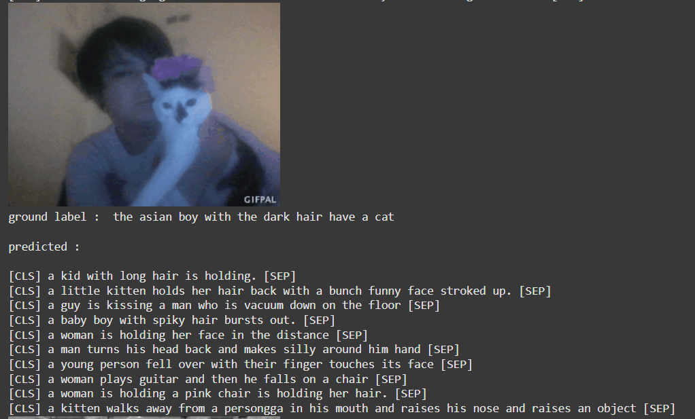

# Vision-Language-Model-from-Scratch : Video-Captionner
# Project Overview

This project focuses on developing a video captioning system—a task aimed at generating meaningful natural language descriptions for video content. The objective was to bridge computer vision and natural language processing, but the experiment faced challenges, resulting in captions that were inconsistent and inaccurate. Despite this, the journey provided valuable insights and potential paths forward.
This Work Was Inspired by:
**VideoCoCa: Video-Text Modeling with Zero-Shot Transfer from Contrastive Captioners**
https://arxiv.org/pdf/2212.04979
**Andrej karpathy Video** 
https://www.youtube.com/watch?v=l8pRSuU81PU&t=10126s&ab_channel=AndrejKarpathy
## Motivation and Importance

Video captioning has diverse applications, including:

- **Accessibility**: Assisting visually impaired individuals.
- **Content Search**: Improving video retrieval in large datasets.
- **Social Media**: Automating captions for user-generated content.
- **Education**: Summarizing instructional videos.
- **Entertainment**: Enhancing multimedia metadata for recommendations.

The task is challenging due to the need to extract meaningful information from frames and generate coherent, human-like text descriptions.

## Architecture Overview and Notebook Contents

### Architecture Overview

The system is built around an encoder-decoder transformer architecture. Key components include:

- **Encoder**: Extracted visual features using CNN-based backbones (e.g., ResNet16, ResNet18) are fed to MultiHead attention Layers.
- **Decoder**: Auto-regressively Generates captions, leveraging trainable embedding tables and MultiHead decoders for natural language generation.
- **Alignment Mechanisms**: Incorporates contrastive loss for aligning frame and text embeddings.

### Notebook Contents

The Python notebook documents the work:

1. **Data Preprocessing**: Steps for preparing video frames or GIFs for model input.
2. **Model Design (architecture)**: Detailed implementation of encoder-decoder architecture and optimization techniques.

4. **Experiments**: Logs of results  and model configurations.
5. **Evaluation**: Analysis of generated captions and qualitative testing outcomes.

## Phases and Challenges

### Initial Approach: Pretrained ResNet16 and BertEmbedder

1. **Dataset**: Microsoft MSR-VTT dataset.
2. **Architecture**: Transformer model with ResNet16 for visuals and BertEmbedder for text.
3. **Challenges**:
   - Computationally intensive training.
   - Failed to produce coherent sentences or recognize video context.
   - Video preprocessing caused improper cropping, obscuring key objects.

### Transition to GIFs and ResNet18

1. **Dataset**: Switched to T-GIF dataset to reduce computational load GIFs are lighter than videos and can lead to the same task (Video Captionning).
2. **Improvements**:
   - Stored image embeddings in tensors.
   - Used uniform frame sampling (16 frames per GIF).
3. **Challenges**:
   - Limited improvement in sentence coherence and context capture.

### Contrastive Loss and Embedding Table

1. **Enhancements**:
   - Added contrastive loss inspired by Video-CoCa to align text and frame embeddings.
   - Replaced Bert embeddings with a learnable embedding table, improving sentence structure learning.

2. **Outcomes**:
   - Occasionally captured main actions but lacked consistency.
   - Tested across multiple GIFs with varying results.

### Regularization and Simplification

1. **Overfitting Mitigation**:
   - Applied weight decay, dropout layers, and LayerNorm adjustments.
   - Reduced parameters to 71M, slightly improving performance.
2. **Data Augmentation**: Avoided due to computational constraints. Used early stopping to manage overfitting.
## Results
### Some Good Examples

### A really bad inference example

## Future Improvements

1. **Better Backbones**:
   - Trainable Vision Transformers or pretrained Video S3D models.
2. **Advanced Techniques**:
   - Use rotary positional encodings.
3. **Improved Dataset**:
   - Larger, better-aligned datasets for stronger text-image alignment.
4. **Refined Architectures**:
   - Explore multi-scale attention or cross-modal transformers.
5. **Resource Access**:
   - Extended use of high-performance GPUs for deeper experimentation.

## Conclusion

While the project didn’t achieve consistent captioning results, it served as a valuable learning experience. Future iterations will focus on addressing these limitations with state-of-the-art techniques and better resources to advance video captioning capabilities.

